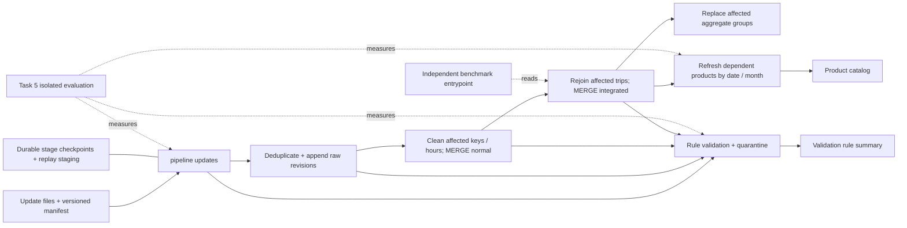
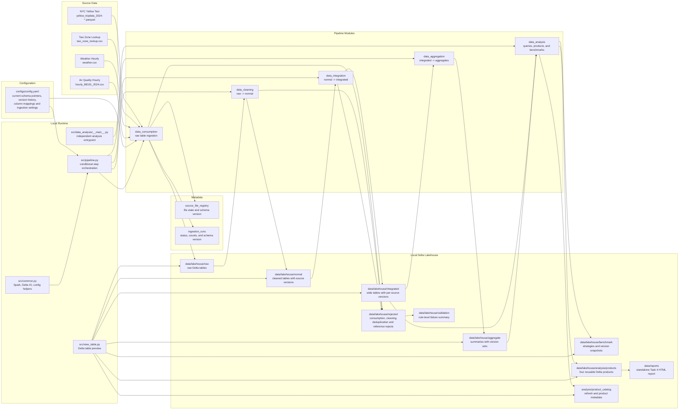
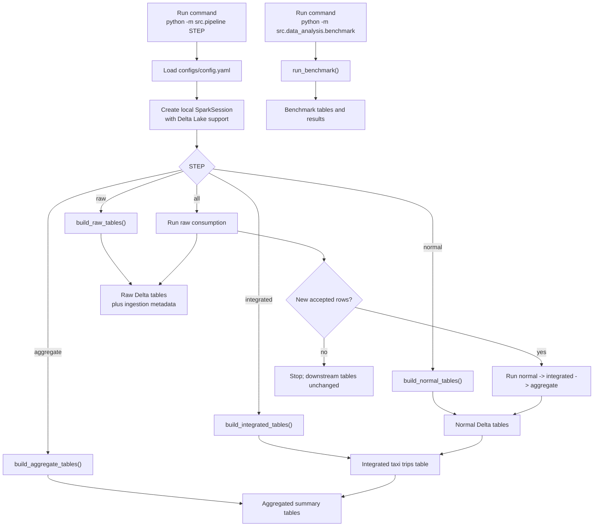

# Project Architecture

## Week 3 Incremental Path



The Week 1 manual full-build commands remain available. Week 3 updates use the
scoped path above; analytical product maintenance runs automatically, but query
timing/optimization benchmarks and HTML report export remain independent.

## Overall Architecture



## Pipeline Flow



## Storage Layout

```text
data/
  raw/                         Source files copied from the assignment dataset
  lakehouse/
    raw/                       Delta tables with row-level schema-version lineage
    normal/                    Cleaned and standardized Delta tables
    integrated/                Joined analysis-ready Delta tables
    aggregate/                 Aggregated Delta tables
    benchmark/                 Tables for storage strategy comparison
    analysis/
      products/                Four reusable analytical Delta products
      product_catalog/         Product contracts, refresh metrics, and lineage
    rejected/
      consumption/             Row-level source type conversion failures
      cleaning/                Business-rule and required-field failures
      deduplication/           Exact duplicates and conflicting revisions
      reference/               Missing lookup references
    validation/
      rule_summary/            Counts by dataset, stage, rule, and category
  metadata/
    source_file_registry/      File state and last successful schema version
    ingestion_runs/            Per-run status, schema version, counts, and errors
  reports/
    task4_data_products_report.html
                               Standalone browser visualization of Task 4 products
```

## Schema-Version Semantics

`current_schema_version` selects one definition from each dataset's
`schema_versions` mapping. The selected version is stored as `_schema_version`
when a raw record is ingested. Moving the pointer does not count as a source-file
change, so it does not automatically rebuild history. New or changed files
receive the current version; an explicit backfill is required when historical
records must be reinterpreted.

Normal, integrated, aggregate, and benchmark tables are derived products. In
particular, one integrated row may depend on several source datasets with
different schema versions, so the pipeline does not label it with one ambiguous
global version. Normal tables retain their source versions; integrated tables
use source-specific version columns; aggregate tables collect distinct version
sets; and benchmark results store a JSON version snapshot. Raw tables and
ingestion metadata remain the authoritative lineage sources.

Task 4 products are independently refreshed from a pinned Integrated Delta
version. Product rows retain their own schema version, the source Delta version,
the source schema-version snapshot, and creation/refresh timestamps. The product
catalog additionally records users, grain, materialization rationale, row count,
active Delta storage, refresh duration, and partition strategy.

Source column names and Parquet physical types are validated against the active
schema contract during consumption. CSV values are converted using declared
`column_types`; conversion failures are retained in rejected Delta tables with
their original values and reasons. Cleaning applies semantic validation and
writes its own rejected records instead of silently dropping them. Missing or
unexpected source columns are file-level contract failures and fail the run.
