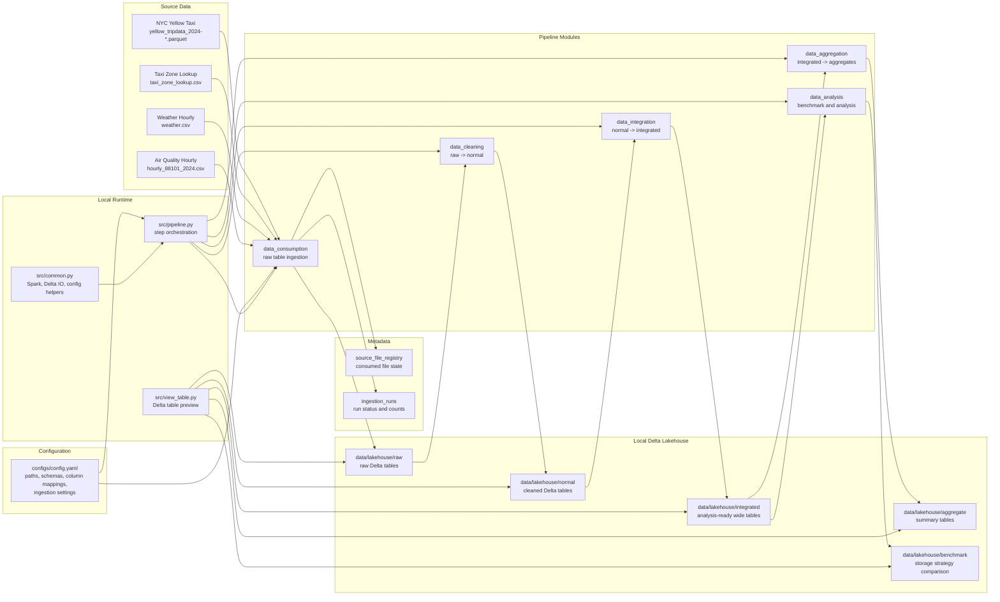
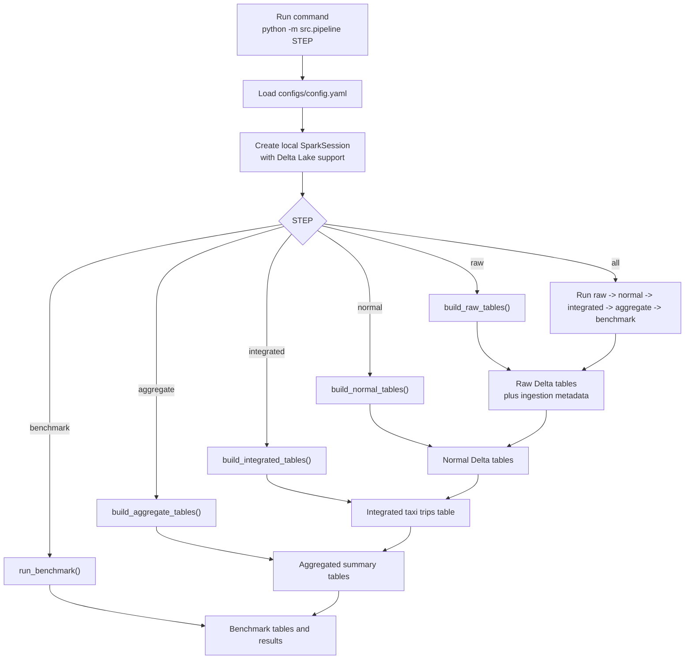

# Project Architecture

## Overall Architecture



## Pipeline Flow



## Storage Layout

```text
data/
  raw/                         Source files copied from the assignment dataset
  lakehouse/
    raw/                       Delta tables produced by data consumption
    normal/                    Cleaned and standardized Delta tables
    integrated/                Joined analysis-ready Delta tables
    aggregate/                 Aggregated Delta tables
    benchmark/                 Tables for storage strategy comparison
  metadata/
    source_file_registry/      File-level incremental ingestion state
    ingestion_runs/            Per-run status, row counts, and errors
```

## Current Week 1 Scope

The current implemented data path is:

```text
data/raw -> src/data_consumption -> data/lakehouse/raw + data/metadata
```

The later steps already have separate module folders and pipeline hooks, but their
business logic is intentionally kept minimal until the cleaning, integration,
aggregation, and benchmark tasks are implemented.
