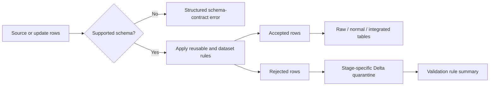

# Week 3 Task 4 — Extensible Validation Framework

## Goal

The validation layer prevents bad records from silently entering curated
tables without turning every data error into a failed pipeline run. It separates
valid and invalid rows, keeps the valid flow running, preserves invalid rows for
investigation, and produces a rule-level report across all datasets.

## Processing model



Every rejected row retains the source columns plus:

| Field | Meaning |
|---|---|
| `_validation_rule_ids` | Stable machine-readable IDs of all failed rules |
| `_validation_categories` | `duplicate`, `conflict`, `incomplete`, `invalid_value`, or `missing_reference` |
| `_rejection_reasons` | Human-readable explanations |
| `_rejection_stage` | `consumption`, `cleaning`, `deduplication`, or `reference` |
| `_rejected_at` | Detection timestamp |

A row can fail several rules. It is stored once with aligned arrays, so the
report can count individual rule failures without losing the original row.
The release verifier permits cleaning-stage rejects because isolating invalid
rows while valid rows continue is the Task 4 contract. It still fails on source
parse errors, conflicting revisions, missing required references, count
mismatches, or analytical inconsistencies.

## Checks implemented

| Problem | Detection | Result |
|---|---|---|
| Duplicate | Repeated content in a release or content already in raw | Extra row is quarantined; one copy continues |
| Conflicting revision | Same business key has different content in one release | Conflicting rows are quarantined |
| Invalid value | Range, minimum, timestamp, period, duration, unit, or cast rule | Row is quarantined before the next layer |
| Incomplete record | Null business key or required field; blank zone text | Row is quarantined before key selection or cleaning |
| Missing reference | Pickup/dropoff location absent from taxi-zone lookup | Trip is quarantined before integration |
| Unsupported schema | Unknown manifest version, missing/extra source column, incompatible Parquet type | Release/file fails with `SchemaContractError.details` |

The last case is different by design. An unknown layout cannot be interpreted
reliably at row level, so processing stops for that source and records structured
details. The operator must add a new immutable schema contract/version before
retrying. Other datasets and already committed releases remain intact.

## Generic rules versus dataset-specific rules

Generic rules express mechanics that have the same meaning everywhere:

- `required_rule(column)`
- `non_empty_text_rule(column)`
- `range_rule(column, minimum, maximum)`
- `minimum_rule(column, minimum)`
- exact duplicate splitting
- reference existence checks

Dataset-specific rules encode domain policy: the valid taxi pickup period,
maximum trip duration/distance, valid weather ranges, NYC PM2.5 units, and the
taxi-zone foreign keys. Keeping these rules close to each dataset cleaner makes
the policy readable while the framework owns classification and storage.

`ValidationRegistry` can combine rules registered for `"*"` with rules
registered for one dataset. Existing cleaners may also pass a list of rules
directly. Both approaches use the same output contract.

## Extending the framework

For a reusable constraint, add or reuse a rule factory in `src/data_quality.py`.
For a domain-only rule, create a rule beside the relevant cleaner:

```python
from pyspark.sql import functions as F
from src.data_quality import predicate_rule

positive_fare = predicate_rule(
    "taxi.non_negative_fare",
    "fare amount must be non-negative",
    "invalid_value",
    lambda _df: F.col("fare_amount") < 0,
)
```

Then include it in that dataset's rule list or registry. No change is needed in
the accepted/rejected split, quarantine writer, report builder, or monitoring
logic. To support a legitimate source schema change, add a new version under the
dataset's `schema_versions` configuration and declare that version in the
release manifest; do not mutate an old version.

## Operating and verifying

Run an update, build the summary, and inspect both summary and row detail:

```bash
python -m src.pipeline updates --manifest data/raw/updates/<release>/manifest.json
python -m src.pipeline validation
python -m src.view_table validation/rule_summary --limit 100 --no-count
python -m src.view_table rejected/reference/yellow_taxi_trips --limit 20 --no-count
```

Automated tests cover registry extension, multi-category row metadata,
duplicate quarantine, missing references, schema-contract details, invalid taxi
distance handling, and persisted rule-summary aggregation.
